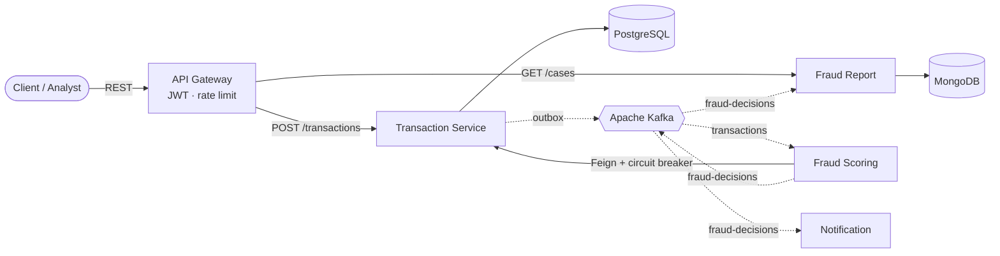

# FraudShield

> A distributed, near-real-time fraud detection platform built with **Java 21**, **Spring Boot**, and **Apache Kafka** — a learning project for studying microservices and event-driven architecture.

🚧 **Status: in active development** (see [Roadmap](#roadmap)). The architecture and design are final; services are being implemented over a 6-week plan.

---

## Overview

FraudShield monitors payment transactions and flags the ones that look **suspicious or unauthorized** — payments that probably weren't made by the legitimate account owner. It is a **post-authorization monitoring** system: transactions are accepted and recorded immediately, then scored asynchronously, and flagged transactions become cases an analyst reviews.

The goal of the project is to demonstrate event-driven microservices and the reliability patterns that make them trustworthy — not a clever detection algorithm (the fraud rules are deliberately simple).

## What this project demonstrates

- **Microservices** with clear service boundaries and database-per-service
- **Event-driven architecture** with Apache Kafka (topics, partitions, consumer groups, ordering)
- **CQRS** — separate write (PostgreSQL) and read (MongoDB) models
- **Transactional outbox pattern** for reliable event publishing (solving the dual-write problem)
- **Idempotent consumers** for safe at-least-once processing
- **Dead-letter topic** + retries for poison-message handling
- **Resilience** — circuit breaker, timeout, and fallback (Resilience4j)
- **API Gateway** with JWT authentication and rate limiting
- **Observability** — distributed tracing with correlation IDs
- **Testing** — integration tests with Testcontainers and contract tests

## Architecture



*Solid arrows are synchronous calls (REST / Feign); dashed arrows are asynchronous Kafka events.*

**Flow:** a payment enters through the gateway, is recorded by the Transaction Service (and published to Kafka via the outbox), scored by Fraud Scoring, and the decision fans out to Fraud Report (a searchable case for analysts) and Notification (an alert to the customer).

### Services

| Service | Responsibility | Store |
|---------|----------------|-------|
| API Gateway | Routing, JWT auth, rate limiting | — |
| Transaction Service | Records payments, publishes events via outbox | PostgreSQL |
| Fraud Scoring | Applies rules, idempotent, emits decisions | PostgreSQL |
| Fraud Report | CQRS read model, serves analyst queries | MongoDB |
| Notification | Sends/logs alerts | — |

### Kafka topics

| Topic | Key | Purpose |
|-------|-----|---------|
| `transactions` | `accountId` | Incoming payments |
| `fraud-decisions` | `transactionId` | Scoring verdicts |
| `transactions.DLT` | `accountId` | Failed messages (dead-letter) |

## Tech stack

- **Language/Framework:** Java 21, Spring Boot 3.x
- **Messaging:** Apache Kafka (KRaft mode)
- **Data:** PostgreSQL (write), MongoDB (read), Flyway (migrations)
- **Spring Cloud:** Gateway, OpenFeign
- **Resilience:** Resilience4j
- **Observability:** Micrometer Tracing + Zipkin
- **Testing:** JUnit, Testcontainers
- **Infrastructure:** Docker Compose

## Key design decisions

- **Database-per-service** — no shared database, so services evolve independently.
- **Outbox pattern** — the payment and its event are written in one DB transaction; a relay publishes to Kafka, so the database and Kafka never disagree.
- **Idempotency via the database** (upsert keyed by transaction ID / `processed_events` table), not Redis — durable, simpler, and shares a transaction with the write. Redis is noted as a future scaling option.
- **CQRS** — the read side is kept current by consuming events; eventual consistency is an accepted trade for decoupling and resilience.
- **Post-authorization monitoring** — asynchronous scoring, not inline blocking. A synchronous fast-path check could be added for hard blocks.

## Project structure

```
fraud-shield/
├── docker-compose.yml
├── README.md
├── CLAUDE.md
├── docs/
│   ├── business-overview.md
│   ├── architecture.md
│   ├── build-plan.md
│   └── adr/
├── api-gateway/
├── transaction-service/
├── fraud-scoring-service/
├── fraud-report-service/
└── notification-service/
```

## Getting started

**Prerequisites:** Docker + Docker Compose, JDK 21.

```bash
# 1. Start infrastructure (Postgres, MongoDB, Kafka, Zipkin)
docker-compose up -d

# 2. Build all services
./mvnw clean package   # or ./gradlew build

# 3. Run a service (example)
cd transaction-service && ./mvnw spring-boot:run
```

**Try it:**

```bash
# Submit a transaction
curl -X POST http://localhost:8080/api/transactions \
  -H "Content-Type: application/json" \
  -d '{"accountId":"...","amount":1299.00,"currency":"USD","country":"FR","channel":"ONLINE"}'

# Query flagged cases (analyst)
curl http://localhost:8080/api/cases?status=OPEN
```

**Secret scanning (recommended):** this repo blocks hardcoded secrets at commit
time via gitleaks. Enable it once per clone:

```bash
pip install pre-commit && pre-commit install
```

## Documentation

- [`docs/business-overview.md`](docs/business-overview.md) — the domain, actors, rules, and the false-positive/false-negative trade-off
- [`docs/architecture.md`](docs/architecture.md) — services, data models, event schemas, endpoints
- [`docs/build-plan.md`](docs/build-plan.md) — the 6-week build plan
- [`docs/adr/`](docs/adr/) — architecture decision records

## Roadmap

- [ ] **Week 1** — Repo, Docker Compose (Postgres + Kafka), Transaction Service intake
- [ ] **Week 2** — Kafka backbone: publish + consume, Fraud Scoring with simple rules
- [ ] **Week 3** — Reliability: outbox, idempotency, dead-letter topic
- [ ] **Week 4** — CQRS read side: Fraud Report (MongoDB) + Notification
- [ ] **Week 5** — API Gateway (JWT + rate limit), Feign + circuit breaker
- [ ] **Week 6** — Observability, Testcontainers tests, docs polish

**Possible next steps:** choreographed saga for multi-step actions, service discovery / config server, Kubernetes deployment, ML-based scoring.

## License

Released under the [MIT License](LICENSE).
